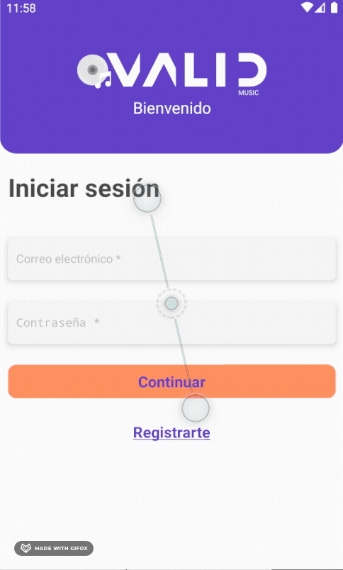
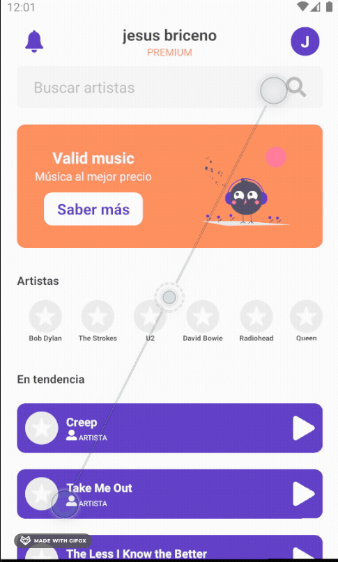
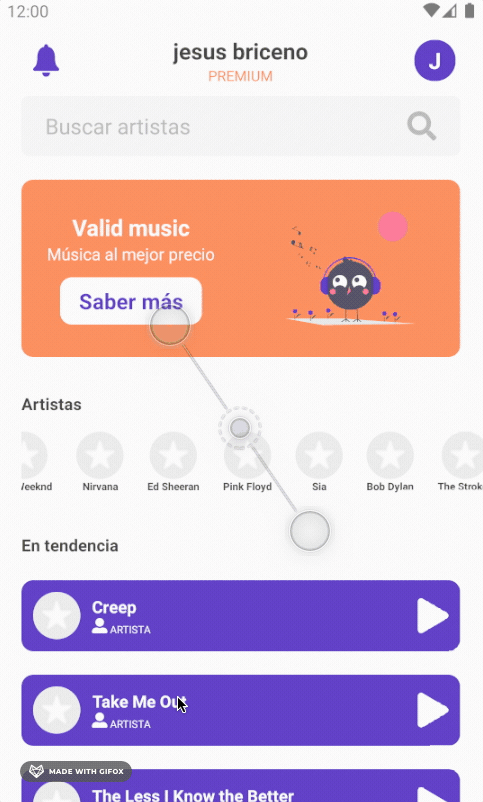

## Preview


## Main technologies used

- [React Native](https://github.com/facebook/react-native)
- [FIREBASE](https://firebase.google.com/)

## Project Set Up

This project was bootstrapped with
[react-native-cli](https://reactnative.dev/docs/getting-started).

This project uses the [LAST.FM](https://www.last.fm/), you need to create a
api and add it API KEY in the .env file. Also, use

### ENV setup

create `.env` files on the root following its respective `.env.example` templates.

---

## Available Scripts

### `npm start`

Runs your app in development mode.

Sometimes you may need to reset or clear the React Native packager's cache. To do so, you can pass the `--reset-cache` flag to the start script:

```
npm start -- --reset-cache
# or
yarn start -- --reset-cache

```

#### `npm run ios`

Like `npm start`, but also attempts to open your app in the iOS Simulator if you're on a Mac and have it installed.

#### `npm run android`

Like `npm start`, but also attempts to open your app on a connected Android device or emulator. Requires an installation of Android build tools (see [React Native docs](https://facebook.github.io/react-native/docs/getting-started.html) for detailed setup). We also recommend installing Genymotion as your Android emulator. Once you've finished setting up the native build environment, there are two options for making the right copy of `adb` available to Create React Native App:

##### Using Android Studio's `adb`

1. Make sure that you can run adb from your terminal.
2. Open Genymotion and navigate to `Settings -> ADB`. Select “Use custom Android SDK tools” and update with your [Android SDK directory](https://stackoverflow.com/questions/25176594/android-sdk-location).

## DOWNLOAD APK

https://cutt.ly/ZndIKbe

## MODULES

## AUTH






## INFINITE SCROLL


## SEARCH


## BONUS


